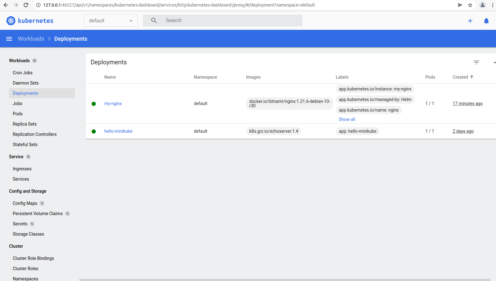
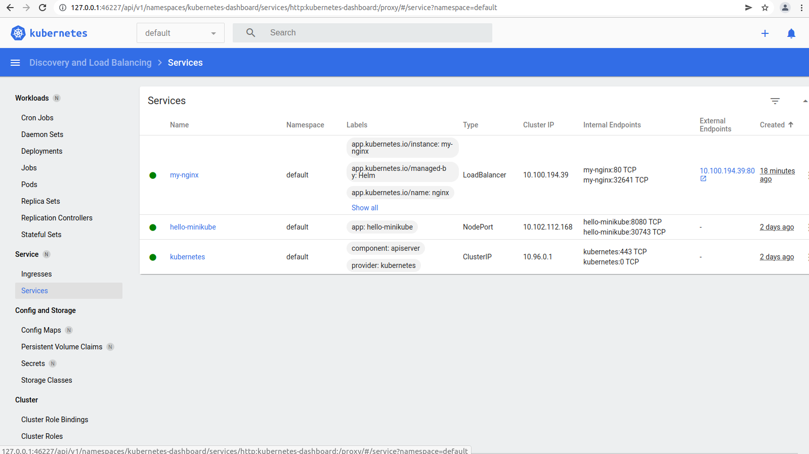
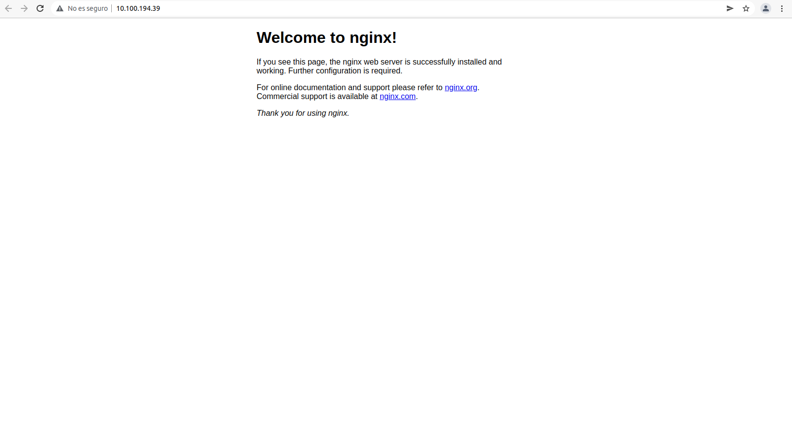

# Add bitnami chart repository
```shell
helm repo add bitnami https://charts.bitnami.com/bitnami
```

# Update helm repositories
```shell
helm repo update
```

# Install nginx relase on minikube on default namespace
```shell
helm install my-nginx bitnami/nginx
```



# Check relases installed
```shell
helm list
```

# Create minikube tunnel to obtain a nginx service public IP
```shell
minikube tunnel --cleanup
```

# Obtain PUBLIC_IP IP from tunnel
```shell
kubectl describe services my-nginx
```



# Access to nginx
```shell
curl http://<PUBLIC_IP>
```



# Uninstall nginx relase
```shell
helm delete my-nginx
```

